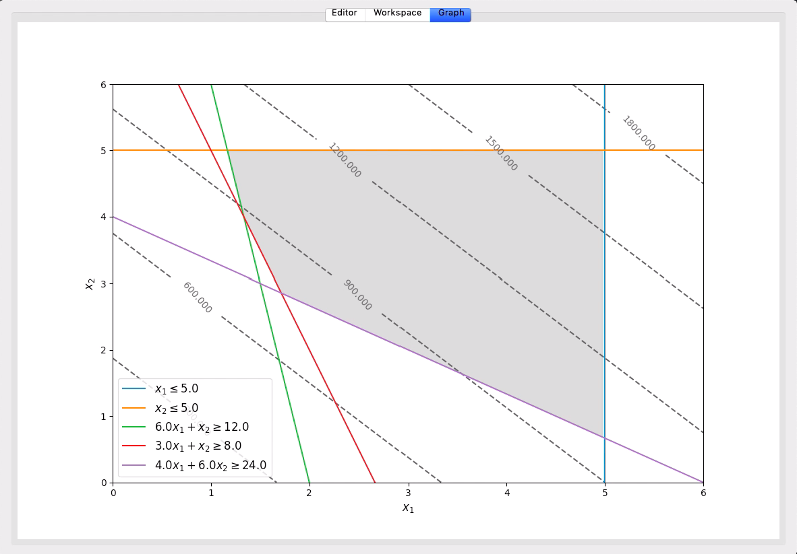
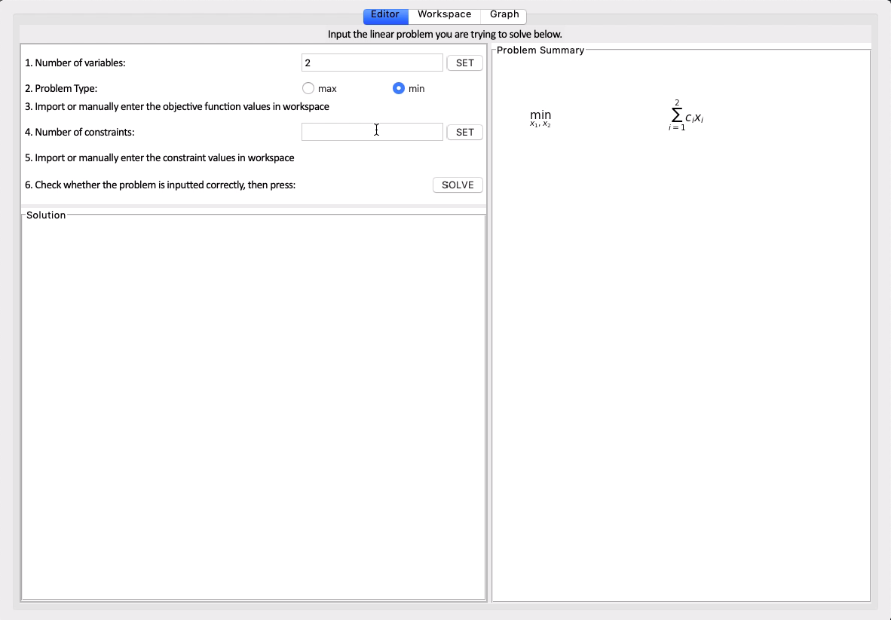
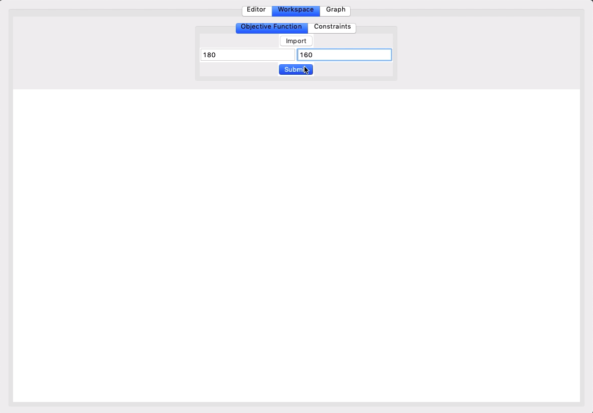
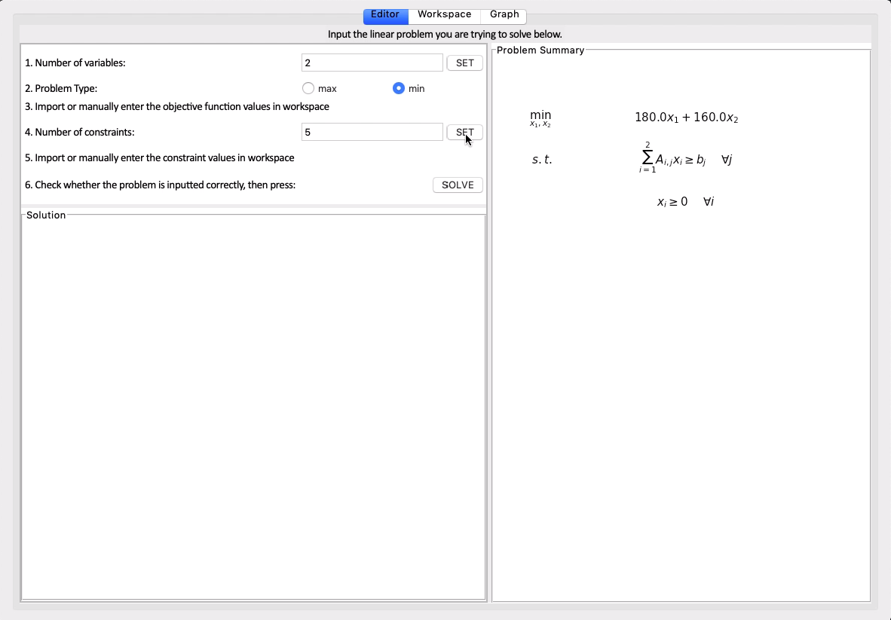
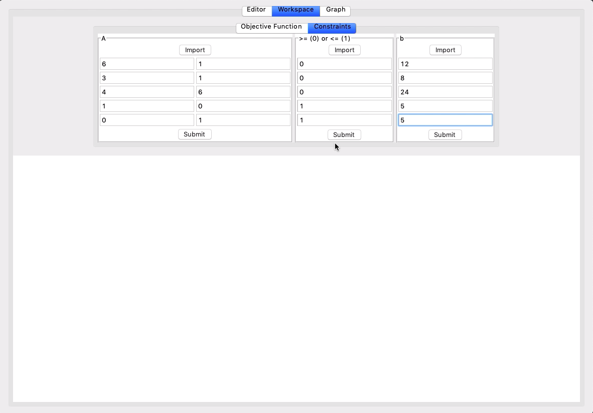
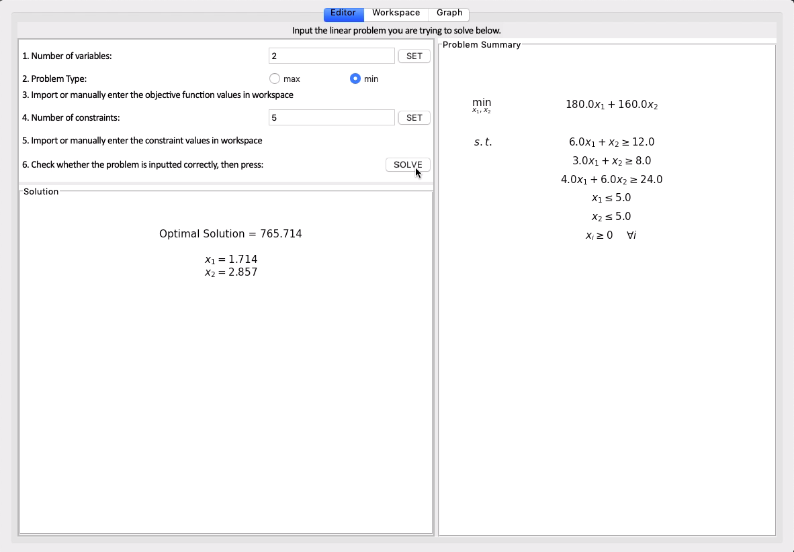

# LPS

LPS is a user friendly mathematical tool for solving linear programming problems exclusively for feasible solutions. The program implements the simplex algorithm using the numpy module to handle matrices to build the backbone of the solver. The main algorithm is based on the standard form, (maximization problem), and the duality of simplex is used to optimize minization problems. The algorithm does not handle infeasible and infinite solutions.



## Table of Contents

1. [Built With](#built-with)
1. [Getting Started](#getting-started)
   1. [Installing Dependencies](#installing-dependencies)
   1. [Development Environment](#development-environment)
1. [Demonstration](#demonstration)
1. [Licensing](#licensing)

## Built With

- [**matplotlib**](https://matplotlib.org/faq/installing_faq.html)
- [**tkinter**](http://www.tkdocs.com/tutorial/install.html)
- [**numpy**](https://scipy.org/install.html)
- [**sympy**](https://scipy.org/install.html)

## Getting Started

### Installing Dependencies

You must install these dependencies using pip:

- [**matplotlib**](https://matplotlib.org/faq/installing_faq.html)
- [**numpy**](https://scipy.org/install.html)
- [**sympy**](https://scipy.org/install.html)

```sh
pip install numpy
```

### Development Environment

To start up the application, from within the root directory:

```sh
python3 ./src/app.py
```

## Demonstration

Let's try to solve this feasible linear programming problem, [Two Mines Problem](http://people.brunel.ac.uk/~mastjjb/jeb/or/basicor.html#twomines). The problem states:

> The Two Mines Company own two different mines that produce an ore which, after being crushed, is graded into three classes: high, medium and low-grade. The company has contracted to provide a smelting plant with 12 tons of high-grade, 8 tons of medium-grade and 24 tons of low-grade ore per week. The two mines have different operating characteristics as detailed below.

```
Mine    Cost per day (£'000)    Production (tons/day)
                                High    Medium    Low
X       180                     6       3         4
Y       160                     1       1         6
```

> How many days per week should each mine be operated to fulfil the smelting plant contract?

This problem can be translated into a Linear Programming formulation as below:

```
min 180x + 160y
s.t.
  6x + y >= 12
  3x + y >= 8
  4x + 6y >= 24
  x <= 5
  y <= 5
  x,y >= 0
```

Let's insert the formula into the application's Editor tab.

After launching the application, the user can follow the steps provided on the Editor tab. First, the user must provide the number of variables and problem type. After inputting the information, the screen will show up as below.


Next, the user must input the parameters for the objective function in the Workspace tab.


Once the user toggles back to the Editor tab, the user can now specify the number of constraints.


Then the user can go back to the Workspace tab to insert the parameters in the constraints. The user can import csv files of the constraints, or manually input them.


Finally, the user can go back to the Editor tab to press "Solve" to calculate the feasible optimal solution of the problem with the values of the variables.


The user can now view the graphical representation of the problem under the Graph tab.


## Licensing

LPS uses the [MIT License](LICENSE.md)
